# 1701QCA Making Interaction - Assessment 2 workbook

You will use this workbook to keep track of your progress through the course and also as a process journal to document the making of your projects. The comments in italics throughout the template give suggestions about what to include. Feel free to delete those instructions when you have completed the sections.

When you have completed the template, submit the link to the GitHub Pages site for this repository as a link in Learning@Griffith. The link should be something like [https://qcainteractivemedia.github.io/1701QCA-Assessment2/](https://qcainteractivemedia.github.io/1701QCA-Assessment2/) where `qcainteractivemedia` is replaced with your GitHub username and `1701QCA-Assessment2` is replaced with whatever you called the repository this template is contained in when you set it up.

## Project working title ##
Fitness Tracker

## Related projects ##

### Related project 1 ###
*Pushup Counter*

*https://create.arduino.cc/projecthub/mixpose/pushup-counter-e3ed69?ref=search&ref_id=fitness&offset=3*

This project is related to mine because of its interaction with humans. Being able to count the reps when you're working out can be a challenge. Therefore I'm wanting to make working out easier for people, by creating a similar project. The code for this project could be something i look into further. 

### Related project 2 ###
*Smart Kickboxing Pad*

*https://create.arduino.cc/projecthub/anas2/smart-kickboxing-pad-2db483?ref=search&ref_id=fitness&offset=2*

This project is related to mine because as i said above, it's around the same area that i want to explore. I enjoed looking through this project, simply to see a different way of connecting someones movement and how many reps they completed. Researching further into this will help with stimulating ideas. 

### Related project 3 ###
*GitFit*

*https://create.arduino.cc/projecthub/359/gitfit-9f14a3?ref=search&ref_id=fitness&offset=4*

This project is related to mine because of the fitness aspect of it. Creating something similar to a fitbit but slightly different. The difference is that it is a reward system that capitalize on the growing wearable technology market. 

### Related project 4 ###
*Fitness Tracker Using POV Display*

*https://create.arduino.cc/projecthub/sayinath/fitness-tracker-using-pov-display-ee49e7?ref=search&ref_id=fitness&offset=0*

This project is related to mine because the aim of this project is to monitor the amount of calories whilst jogging, by pulse and piezo electric sensors. This is similar to the ideas I've had about using sensors to track the reps someone makes. 

### Related project 5 ###
*Get Notified by Email and SMS When Your Pulse Is Abnormal*

*https://create.arduino.cc/projecthub/aghoshbprasad100/get-notified-by-email-and-sms-when-your-pulse-is-abnormal-737cf5?ref=search&ref_id=fitness&offset=5*

This project is related to mine because it's using something that already exists, but then putting a swist on it. This device is similar to heart rate monitoring fitness band, expect this device sends you an SMS or email or both if there is an abnormality detected in your heart rate. 

### Related project 6 ###
*Hamster Fitness Tracker*

*https://create.arduino.cc/projecthub/peter-gullberg2/hamster-fitness-tracker-056d71?ref=search&ref_id=fitness&offset=1*

This project is related to mine because it's a Hamster running tracker. This is very similar to ideas I have, just for humans instead. I thought it was an interesting project, that i could gain some basic knowledge and skills from. 

## Other research ##

Within my research I've come across another project called *Personal Gym Timer*. The gym timer tracks you workout rep time, rest time and number of sets and when the time elapses, it alerts ther user visually and audibly. I really liked how this project encourages you to get the maximum results whenever your at the gym. 

I gathered information about how the project was made and how it works. When the timer is turned on, it operates in two basic modes, Auto mode and Set mode. This could be something i explore further to include in my own project design. When the auto mode is on, the user just needs to press the Green push button and start their workout. In this project, it will count up 60 seconds for the workout and down 30 seconds for rest time. This will then increase the number of sets (large red SSD) by one (new number of sets is 2) and count up 60 seconds then count down 30 seconds for rest. The workout time and rest time are also adjustable. 

Overall this project is extremely user friendly and simple to use. You can see the creater has thought about how the Timer would work for people who are visually impaired or have hearing difficulties, because the Timer alerts the user visually and audibly. Also, having the an adjustable workout and rest time is important for the flexablity of users. Below are images of the project and link to show how it works. 

https://create.arduino.cc/projecthub/wickPro/personal-gym-timer-f554b4?ref=search&ref_id=workout&offset=0

## Conceptual progress ##

### Design intent ###
*I intend to create an easy and fun way of tracking your reps while working out.*

### Design concept 1 ###
The concept for this design was to create a yoga mat into an at home workout tool. The idea is to create a bop it experience when working out. Sensor will be attached to the bottom of the yoga mat to send signals to the mirco bit that the particualr exercise is completed, therefore another exercise will be called out and the user will complete the next.

For example, the mat will indicate to the user to complete a 30sec plank. When the user completes this task, the mat will continue into the next. The longer you continue completing all the challenges the better your overall workout will be.

These two images show examples of how the yoga mat would look and how it'd be used. The white tapped crosses show where the sensors would be placed underneath the yoga mat. 

The images above shows my thought process and sketches of how I wanted the mat to look. 

### Design concept 2 ###
My second concept was based around the use of a rugby ball. Something I thought would be useful for training purposes would be to create a rugby ball that measures the height, distance and velocity of the ball. This idea could be extremely useful for training purposes, whilst also keeping it entertaining. In order for this to work, I would need to come up with a way to connect the mirco bit to the rugby ball whilst also making sure that wherever this is placed, needs to be somewhere the user wont kick.

### Final design concept ###

My final concept is an adaptable fitness tracker. This fitness tracker will be able to count your reps with whatever exercise you are doing. Keeping track of your reps is something many people struggle with. Being able to not worry about counting and being able to complete your workout efficiently. The tracker can be used at home or in a gym environment, even used for coaching. The meaning behind it being adaptable is the fact that it can be used for several different workouts because you can adapt it to your shoe, wrist or head. If the fitness tracker is placed on a shoe, it's to count how many steps the user has made. If you're wanting to track your arm workouts, then you can attach it anywhere on your arm. For pushups or planks you're able to attach the fitness tracker to your head. For all of these, the fitness tracker comes with adjustable straps that will allow the user to workout with it.

This fitness tracker is interactive in the way the user uses it. The interaction of doing a particular workout is one of its major interactions. As well as the user being able to read how many reps they have completed. The tracker will be able to be turned off and on to save battery life. 

In order to create this, I'll need a way to connect the mirco bit to a band that's adjustable for the use of different interactions. Some sought of attachable velcro could be a could choice to attach the fitness tracker to the users body. The code for this project is most important for this to be able to function in the best way. 

Images below will show my sketches and rough ideas of how the fitness tracker will look. 

### Interaction flowchart ###

## Physical experimentation documentation ##

*Technical Development & Fabrication*

Part 1 - Developing a simple footstep tracker:

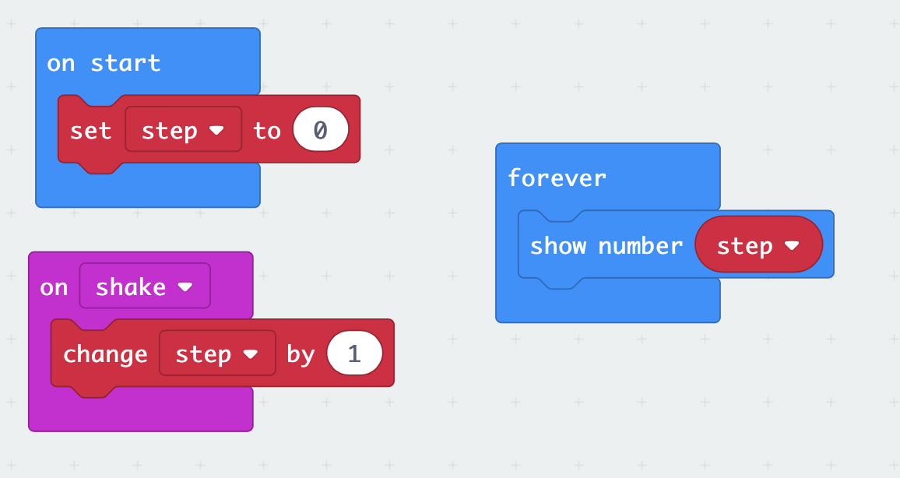

*To start with the building of code, I needed a variable to store my number of steps. And then I needed the number of steps to be triggered by something. I added on shake to detect the step. In order for to always be able to see how many steps were counted I used a forever loop and added a show number to display the value of steps.*

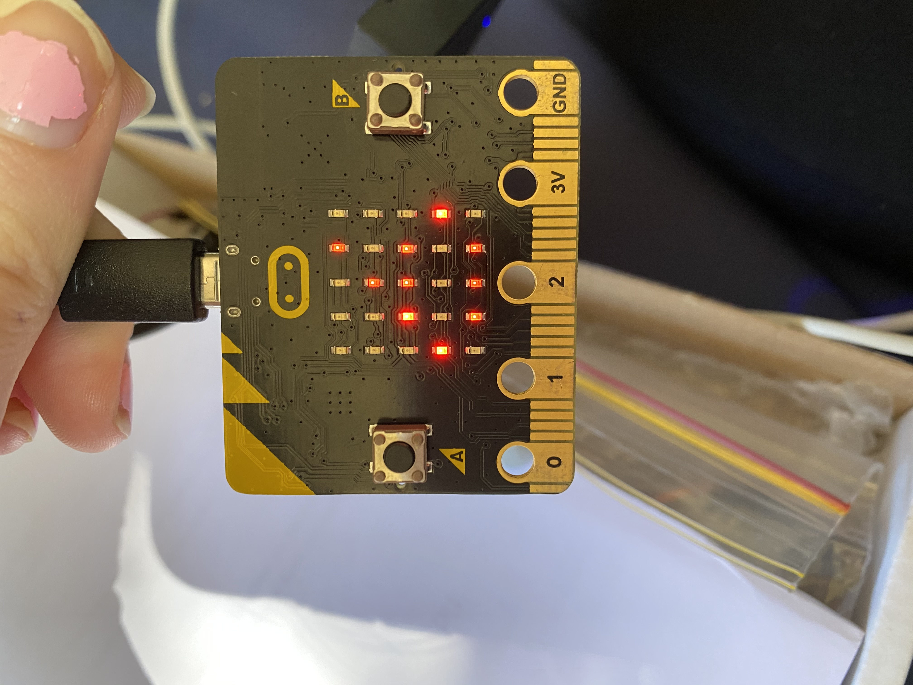                        

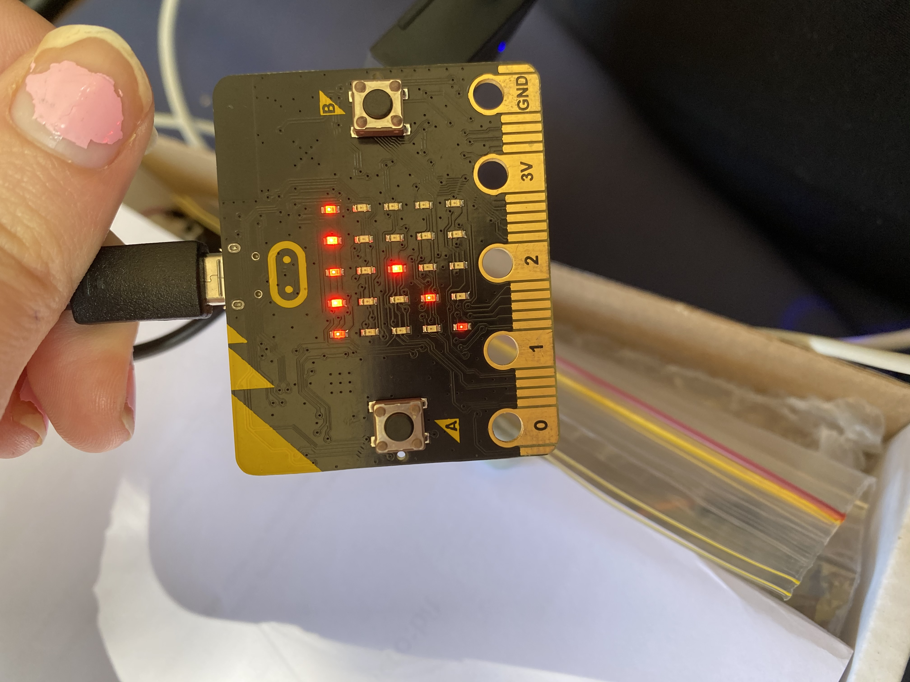

https://youtu.be/xpRm7SZrRWc

Click link to see the process in action.

*Images above show the number of steps when the mirco bit is shaken. When I did this, I noticed a delay in the display of steps. My next step will be to fix this problem with code* 

Part 2 - Developing a simple footstep tracker:

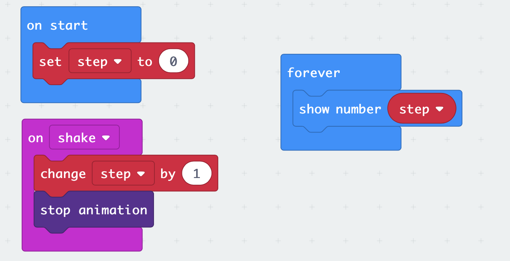

*In order to get rid of the deplay in the display, I've used stop animation after changing the value of steps. This worked really effectively*

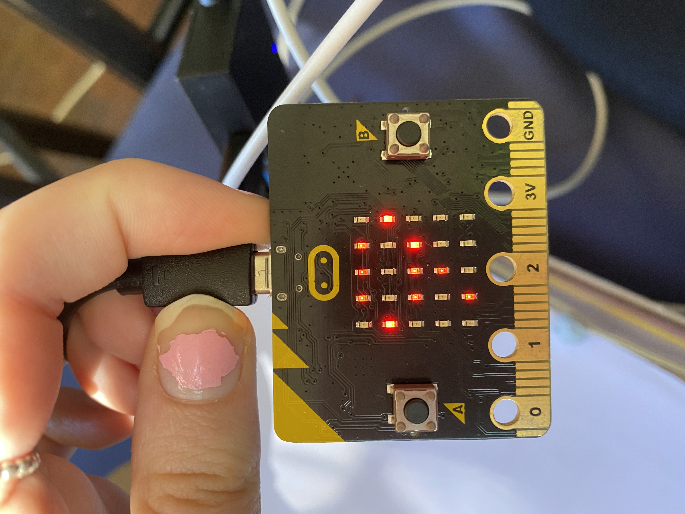

https://youtu.be/Vyo8XVtFUdI

Click link to see the process in action.

Part 3 - Physical Models for footstep tracker:

*Images above show a rough physical model of how I would want my fitness tracker to look. For this I've used all the code above as well. This is just a rough idea of how I want it to look, but I'll need to find an easy way to transfering it from a step tracker to an overall fitness tracker.* 

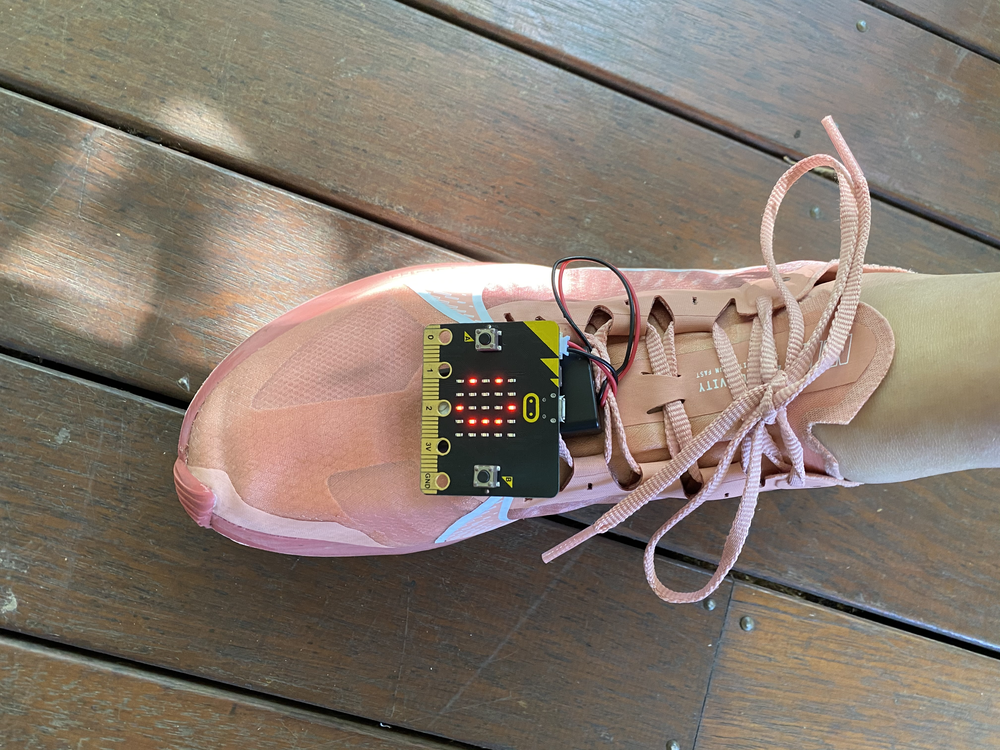

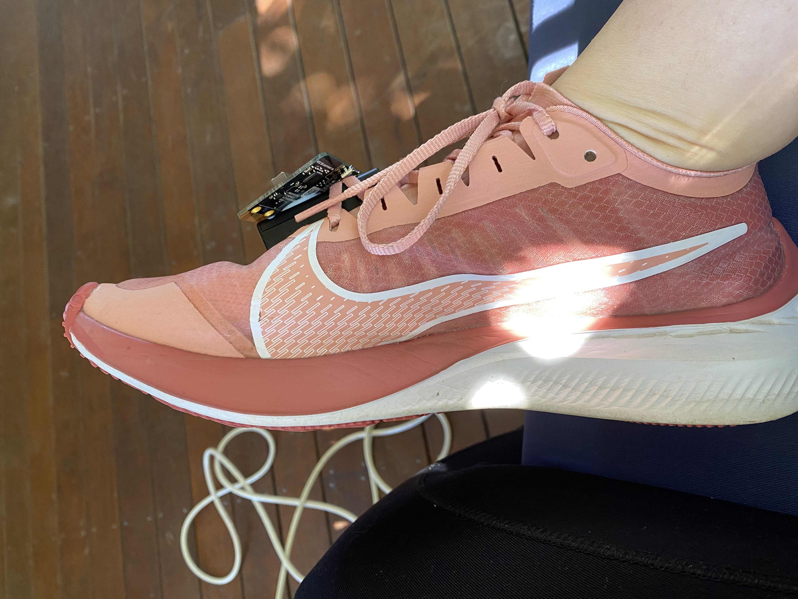

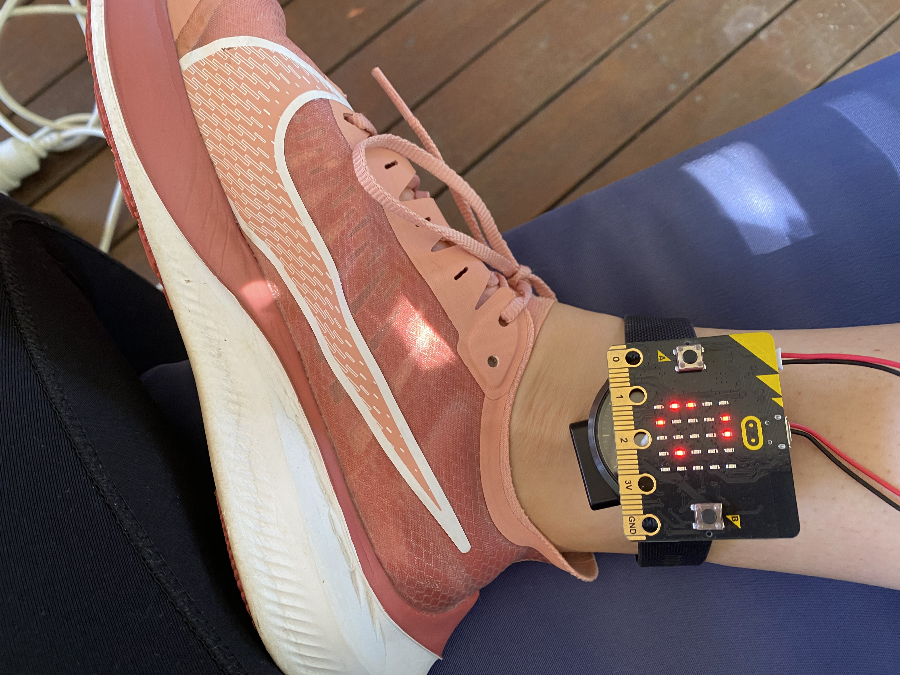

https://youtu.be/M9uuReAEUHc

Click on the link to see it in action.

Part 4 - Developing wrist tracker:

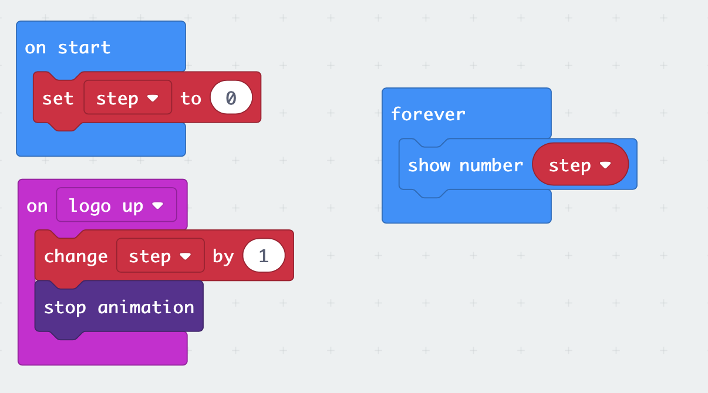

*As shown above, I've used the basic code that I used for the footstep tracker but instead using shake, I replaced it with on log up. For arm workouts you usually use weights which you lift up and down, therefore changing the code is very important for it to work properly.*

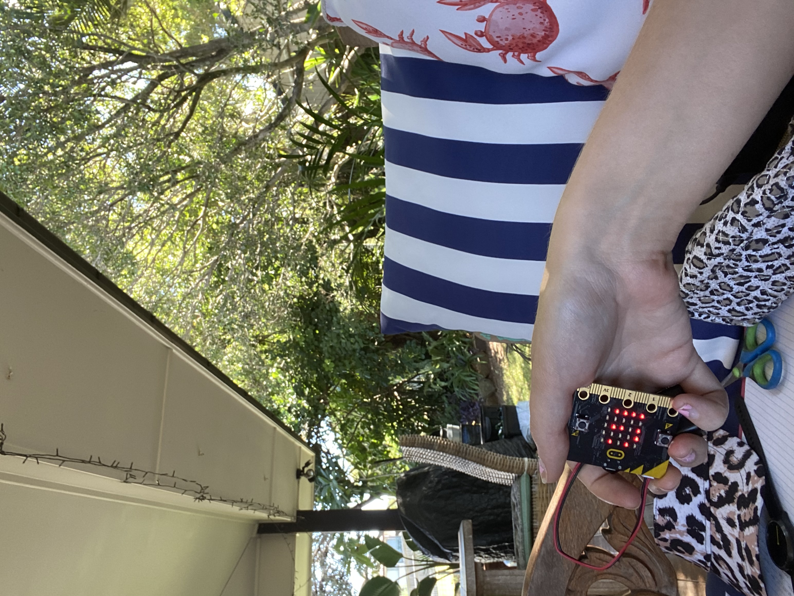

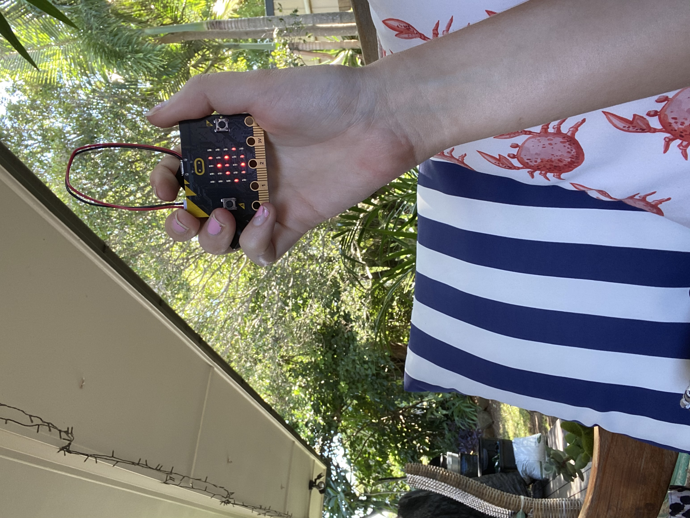

*The first image of myself holding the mircobit shows the step before lifting the weight upwards, to replicate an arm workout. Second image shows once the interaction is completed, as you can see the number has gone up because I've imitated doing an arm workout.*

Part 5 - Physical Model of arm workout tracker:

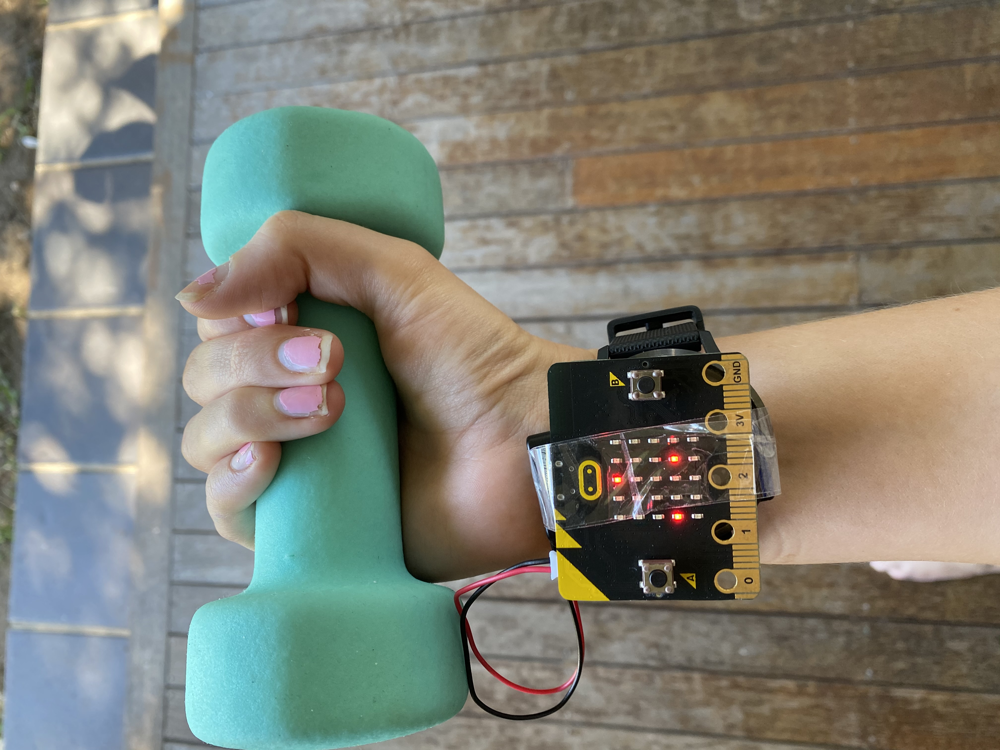

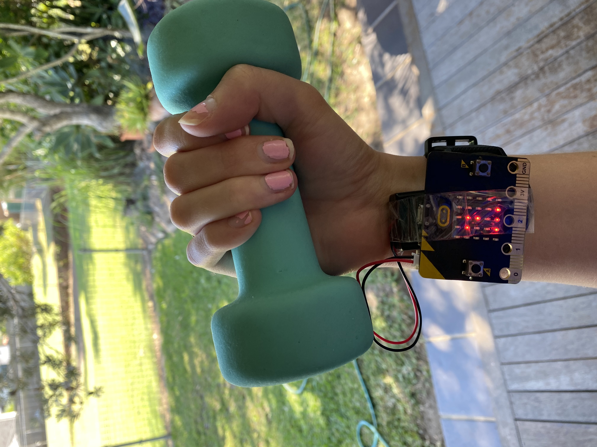

https://youtu.be/KBLnNJi10GA

Click on the link to see it in action

*The images above show my experimentation of my arm workout tracker. The first image is before the interaction of moving the arm up and then second image of the arm upwards. As you can see from the first and second image the amount of reps has gone up by 1. The same code was used to work this aswell.*

Part 6 - Developing push up tracker:

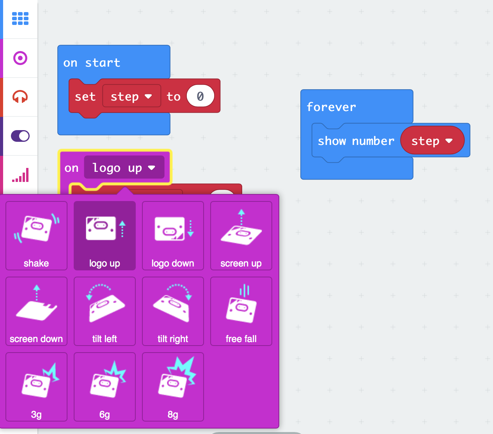

*For this i experiemented with different inputs, changing the way of how the movement will be counted. Overall the best one would be the log up variable which is used for arm workouts as well.*

## Design process discussion ##

My design process has been extremely effective for what I've wanted to achieve. I followed aspects of the Double Diamond design methodology as well to keep myself on track and to help myself with the process of design. Discover is one of the first aspects of the Double Diamond Design. I started this by researching into different projects, to gather information and ideas that'll help me along the way. Once i found myself looking into different projects and decided on the key theme that i was interested in, which is fitness. This then helped norrow down to six projects that all related to my ideas and concepts. 

Define is another aspect of the Double Diamond Design that i have used. The second stage of my process was to come up with my own concepts after researching other peoples works. This process was exciting, because I could let my imagination run free. I did however struggle with coming up with concepts that I thought I'd be able to achieve. My first concept was an interesting one to come up with, I really enjoyed the process of development, but I just couldn't see how I'd be able to create something so big. That is why my next two concepts may be slighly more simple, because these are concepts I know I'll be able to achieve within this course. 

The third aspect of the Double Diamond Design is develop. This stage of the process develops your ideas into something physical. Once I had my concepts and ideas I needed to then explore how I was actually physically make this design. I started out by creating simple code that could help with the starting point. As you can see above, I've documented my process of how I problem solved when their was an issue. Overall the code is quite simple and easy, therefore coming up with more ideas to add onto the process would help. I've now got an understanding of how to create my project, now I'll need to just add onto it. 

Deliver is the last aspect of the Double Diamond design. This is the most important aspect of them all, bringing the design to life. So I've delivered basic protoypes and ways I want to design to work and look. But now it's time to create the actual thing. Some things I will do to improve my design and making it less simple would be to create a sound that makes a noise every time you've completed a rep. Possibly even have it count outloud for you, so the user would'nt even need to look at the fitness tracker. These are just a few ideas to move my design forward and making it stronger. 

## Next steps ##

In order to move my design further I'll need to:
- Finalise my ideas to further improve my design. 
- Gather materials I'll need to start creating. 
- Draw detailed sketches of how I want it to look (to give reference to when building).
- Start the build process. 
- Make sure all documentation is ready to be assessed.

