# 1701QCA Making Interaction - Assessment 2 workbook

You will use this workbook to keep track of your progress through the course and also as a process journal to document the making of your projects. The comments in italics throughout the template give suggestions about what to include. Feel free to delete those instructions when you have completed the sections.

When you have completed the template, submit the link to the GitHub Pages site for this repository as a link in Learning@Griffith. The link should be something like [https://qcainteractivemedia.github.io/1701QCA-Assessment2/](https://qcainteractivemedia.github.io/1701QCA-Assessment2/) where `qcainteractivemedia` is replaced with your GitHub username and `1701QCA-Assessment2` is replaced with whatever you called the repository this template is contained in when you set it up.

## Project working title ##
*Insert a name for the project as you conceive of it at the moment.*

## Related projects ##

### Related project 1 ###
*Pushup Counter*

*https://create.arduino.cc/projecthub/mixpose/pushup-counter-e3ed69?ref=search&ref_id=fitness&offset=3*

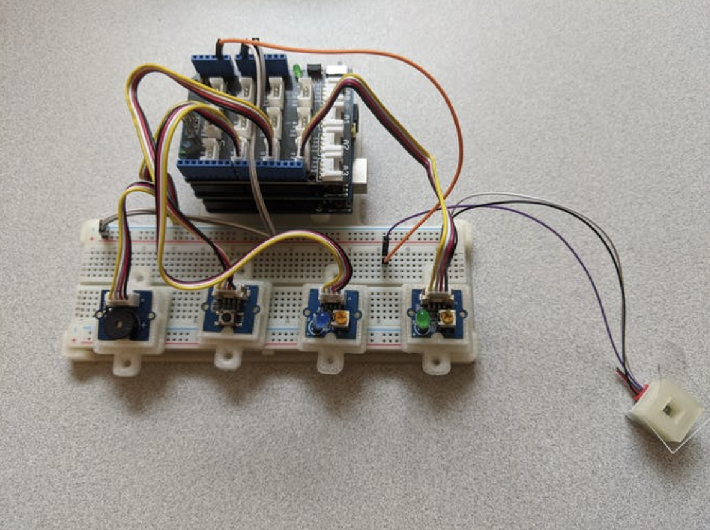

This project is related to mine because *insert reasons here*.

### Related project 2 ###
*Smart Kickboxing Pad*

*https://create.arduino.cc/projecthub/anas2/smart-kickboxing-pad-2db483?ref=search&ref_id=fitness&offset=2*

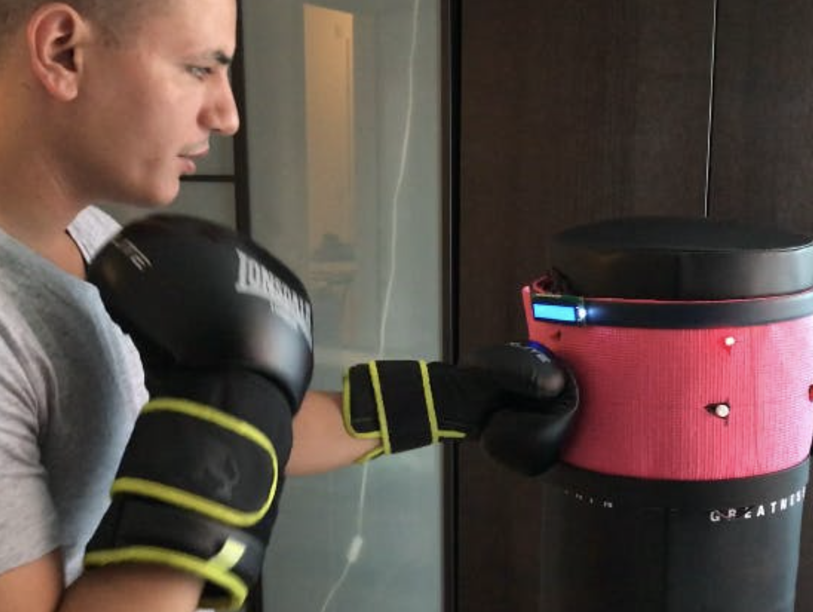

This project is related to mine because *insert reasons here*.

### Related project 3 ###
*GitFit*

*https://create.arduino.cc/projecthub/359/gitfit-9f14a3?ref=search&ref_id=fitness&offset=4*

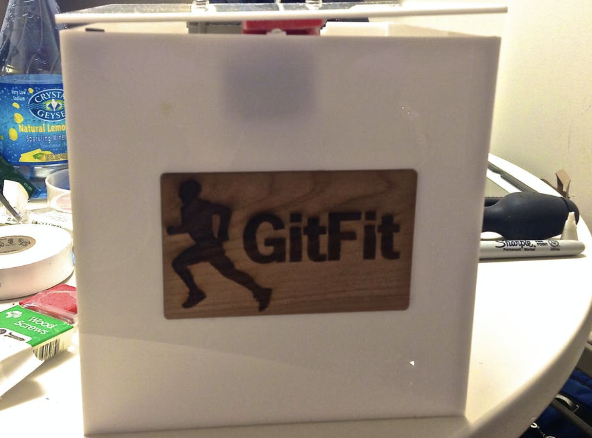

This project is related to mine because *insert reasons here*.

### Related project 4 ###
*Fitness Tracker Using POV Display*

*https://create.arduino.cc/projecthub/sayinath/fitness-tracker-using-pov-display-ee49e7?ref=search&ref_id=fitness&offset=0*

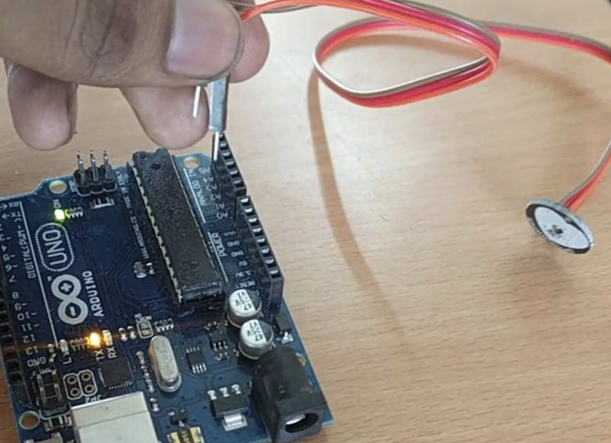

This project is related to mine because *insert reasons here*.

### Related project 5 ###
*Get Notified by Email and SMS When Your Pulse Is Abnormal*

*https://create.arduino.cc/projecthub/aghoshbprasad100/get-notified-by-email-and-sms-when-your-pulse-is-abnormal-737cf5?ref=search&ref_id=fitness&offset=5*

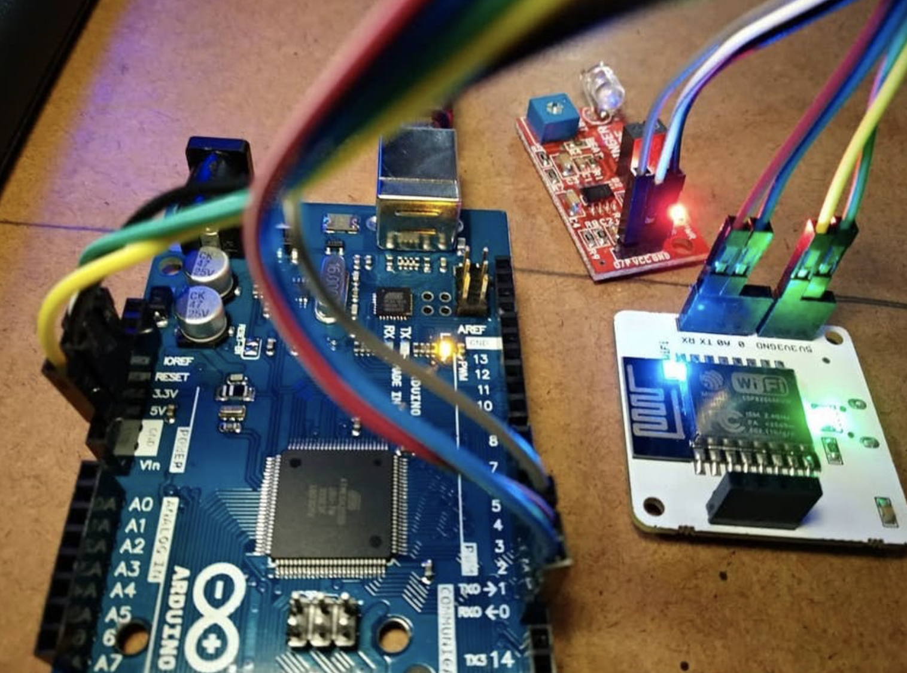

This project is related to mine because *insert reasons here*.

### Related project 6 ###
*Hamster Fitness Tracker*

*https://create.arduino.cc/projecthub/peter-gullberg2/hamster-fitness-tracker-056d71?ref=search&ref_id=fitness&offset=1*

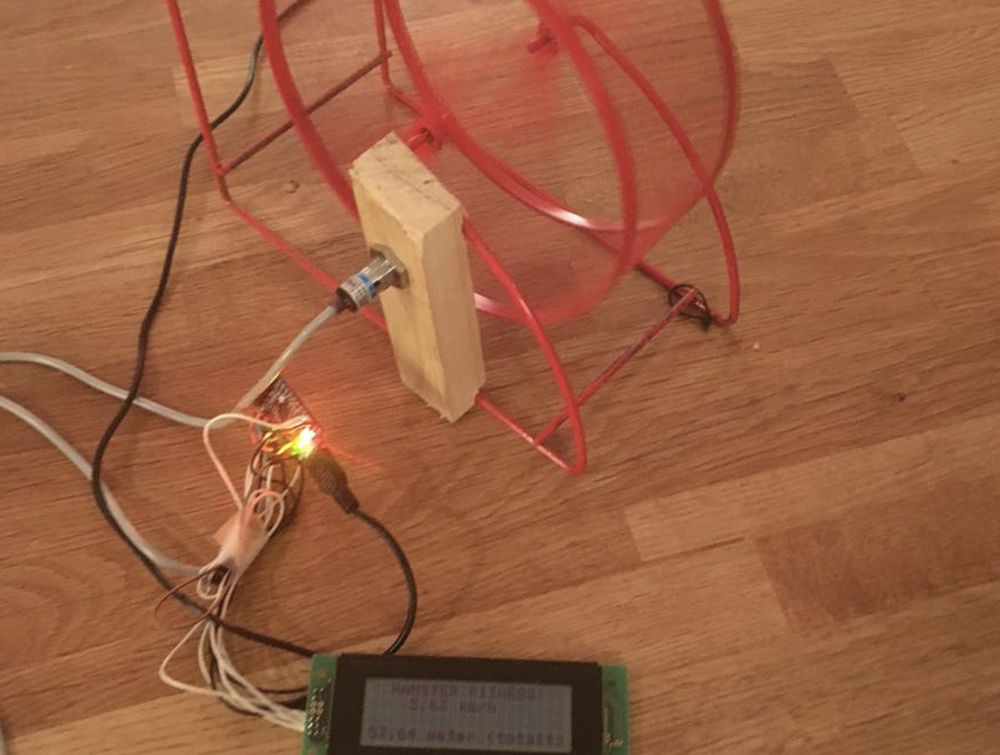

This project is related to mine because *insert reasons here*.

## Other research ##

Within my research I've come across another project called *Personal Gym Timer*. The gym timer tracks you workout rep time, rest time and number of sets and when the time elapses, it alerts ther user visually and audibly. I really liked how this project encourages you to get the maximum results whenever your at the gym. 

I gathered information about how the project was made and how it works. When the timer is turned on, it operates in two basic modes, Auto mode and Set mode. This could be something i explore further to include in my own project design. When the auto mode is on, the user just needs to press the Green push button and start their workout. In this project, it will count up 60 seconds for the workout and down 30 seconds for rest time. This will then increase the number of sets (large red SSD) by one (new number of sets is 2) and count up 60 seconds then count down 30 seconds for rest. The workout time and rest time are also adjustable. 

Overall this project is extremely user friendly and simple to use. You can see the creater has thought about how the Timer would work for people who are visually impaired or have hearing difficulties, because the Timer alerts the user visually and audibly. Also, having the an adjustable workout and rest time is important for the flexablity of users. Below are images of the project and link to show how it works. 

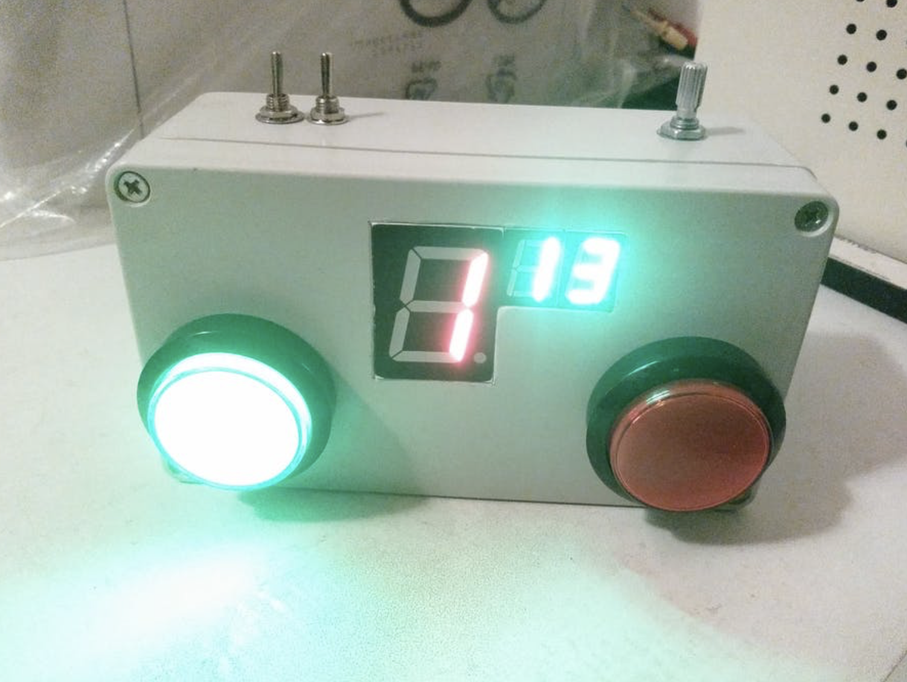

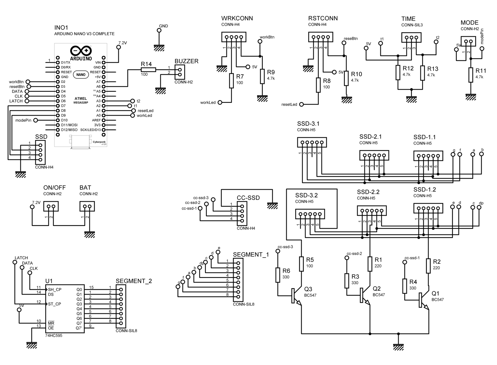

https://create.arduino.cc/projecthub/wickPro/personal-gym-timer-f554b4?ref=search&ref_id=workout&offset=0

## Conceptual progress ##

### Design intent ###
*Include your design intent here. It should be about a 10 word phrase/sentence.*

### Design concept 1 ###
The concept for this design was to create a yoga mat into an at home workout tool. The idea is to create a bop it experience when working out. Sensor will be attached to the bottom of the yoga mat to send signals to the mirco bit that the particualr exercise is completed, therefore another exercise will be called out and the user will complete the next.

For example, the mat will indicate to the user to complete a 30sec plank. When the user completes this task, the mat will continue into the next. The longer you continue completing all the challenges the better your overall workout will be.

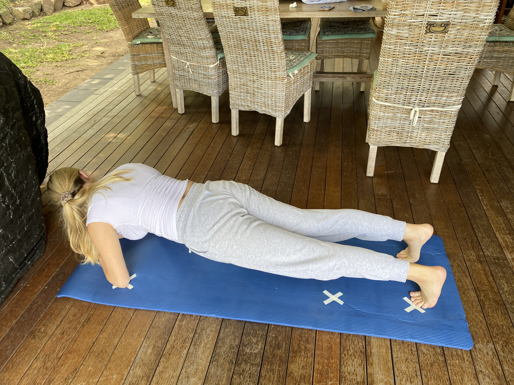

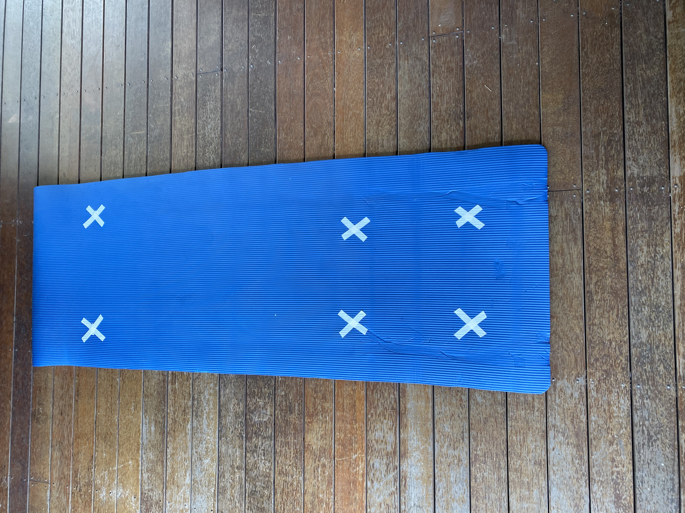

These two images show examples of how the yoga mat would look and how it'd be used. The white tapped crosses show where the sensors would be placed underneath the yoga mat. 

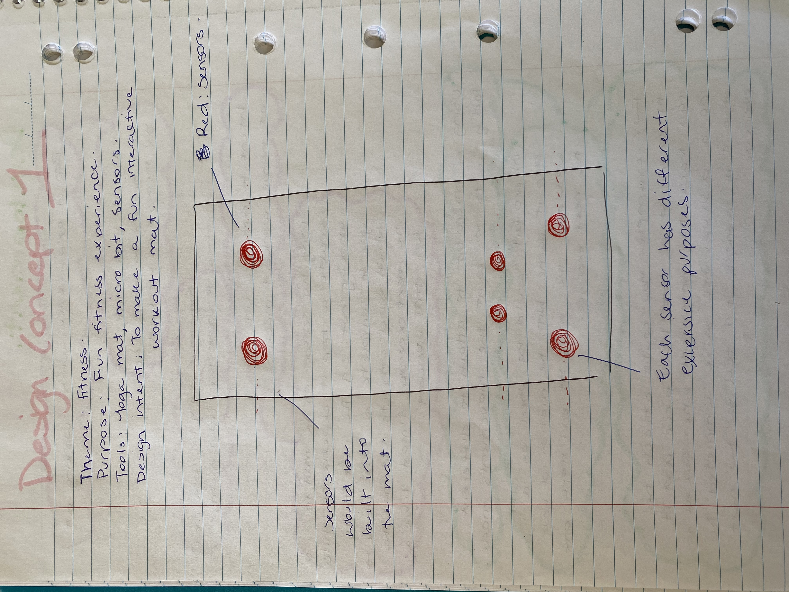

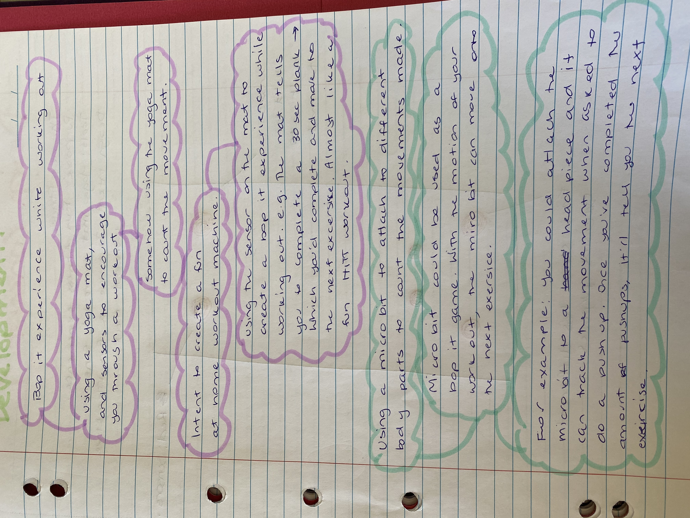

The images above shows my thought process and sketches of how I wanted the mat to look. 

### Design concept 2 ###
My second concept was based around the use of a rugby ball. Something I thought would be useful for training purposes would be to create a rugby ball that measures the height, distance and velocity of the ball. This idea could be extremely useful for training purposes, whilst also keeping it entertaining. In order for this to work, I would need to come up with a way to connect the mirco bit to the rugby ball whilst also making sure that wherever this is placed, needs to be somewhere the user wont kick.

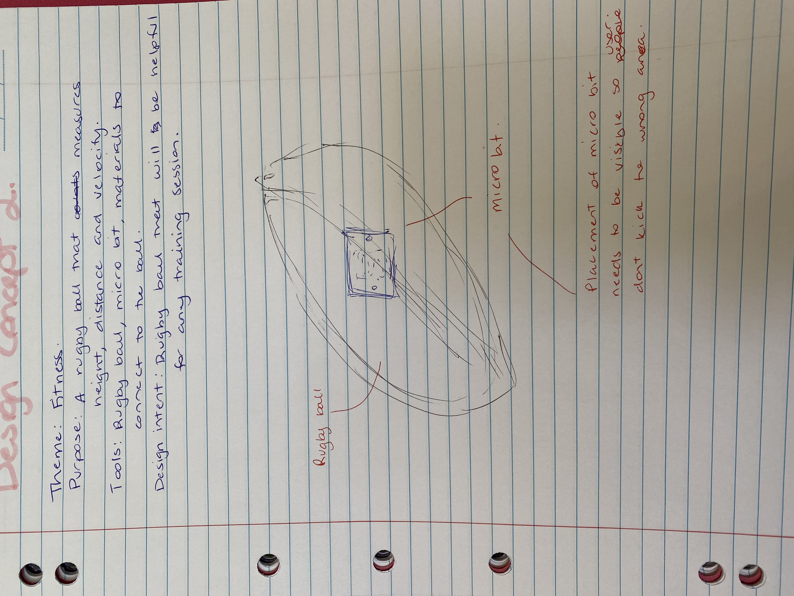

### Final design concept ###

My final concept is an adaptable fitness tracker. This fitness tracker will be able to count your reps with whatever exercise you are doing. Keeping track of your reps is something many people struggle with. Being able to not worry about counting and being able to complete your workout efficiently. The tracker can be used at home or in a gym environment, even used for coaching. The meaning behind it being adaptable is the fact that it can be used for several different workouts because you can adapt it to your shoe, wrist or head. If the fitness tracker is placed on a shoe, it's to count how many steps the user has made. If you're wanting to track your arm workouts, then you can attach it anywhere on your arm. For pushups or planks you're able to attach the fitness tracker to your head. For all of these, the fitness tracker comes with adjustable straps that will allow the user to workout with it.

This fitness tracker is interactive in the way the user uses it. The interaction of doing a particular workout is one of its major interactions. As well as the user being able to read how many reps they have completed. The tracker will be able to be turned off and on to save battery life. 

In order to create this, I'll need a way to connect the mirco bit to a band that's adjustable for the use of different interactions. Some sought of attachable velcro could be a could choice to attach the fitness tracker to the users body. The code for this project is most important for this to be able to function in the best way. 

Images below will show my sketches and rough ideas of how the fitness tracker will look. 

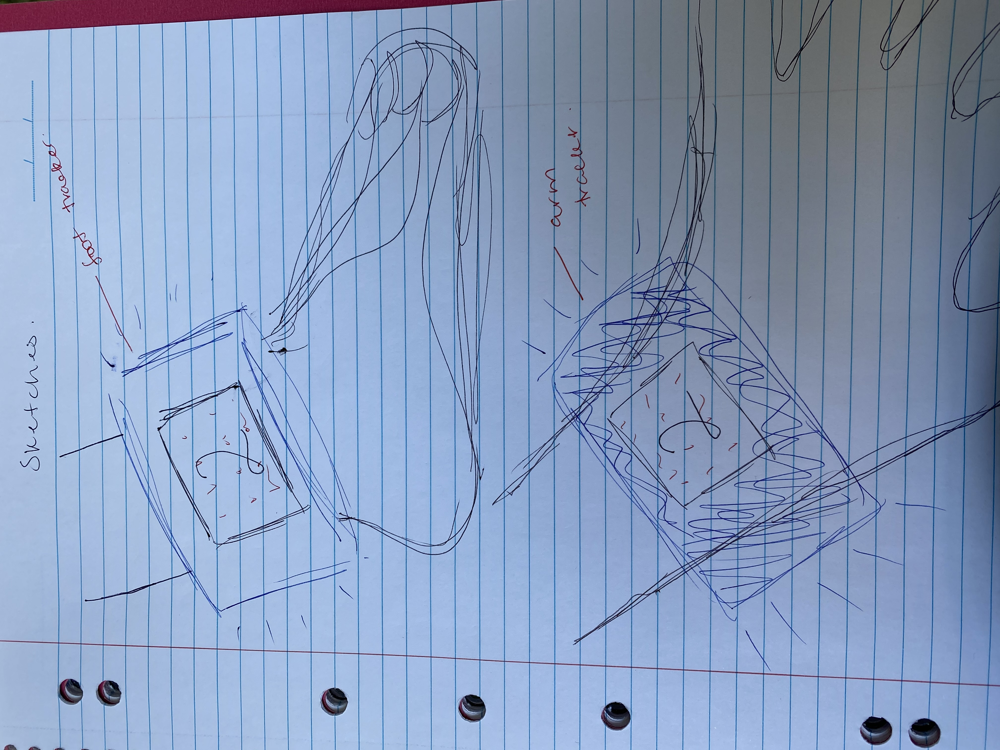

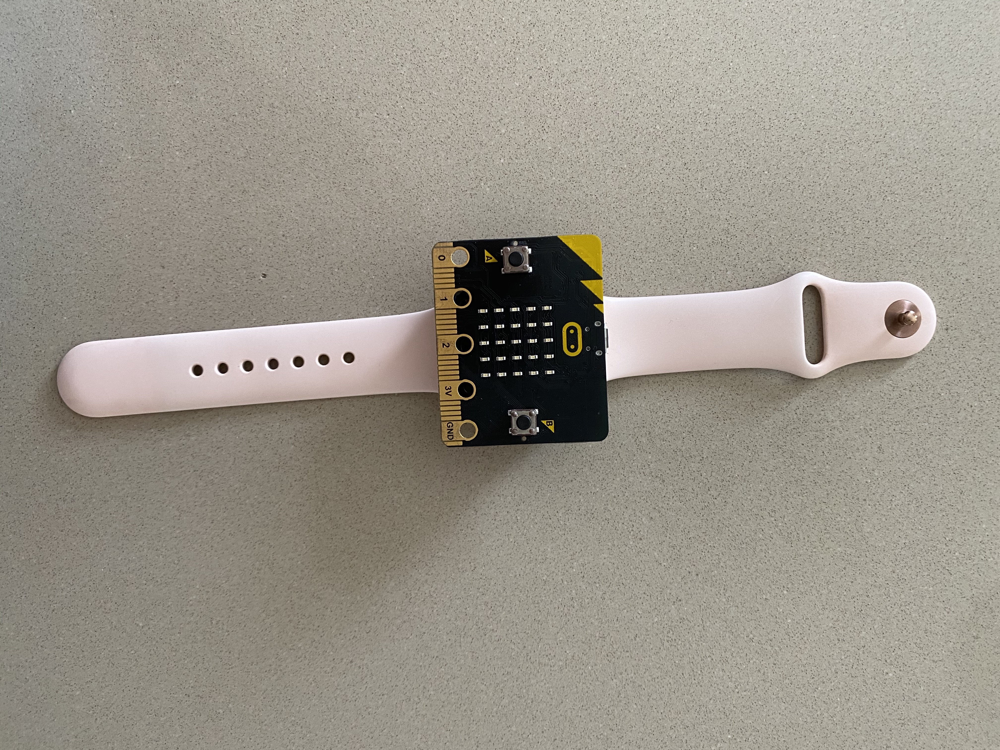

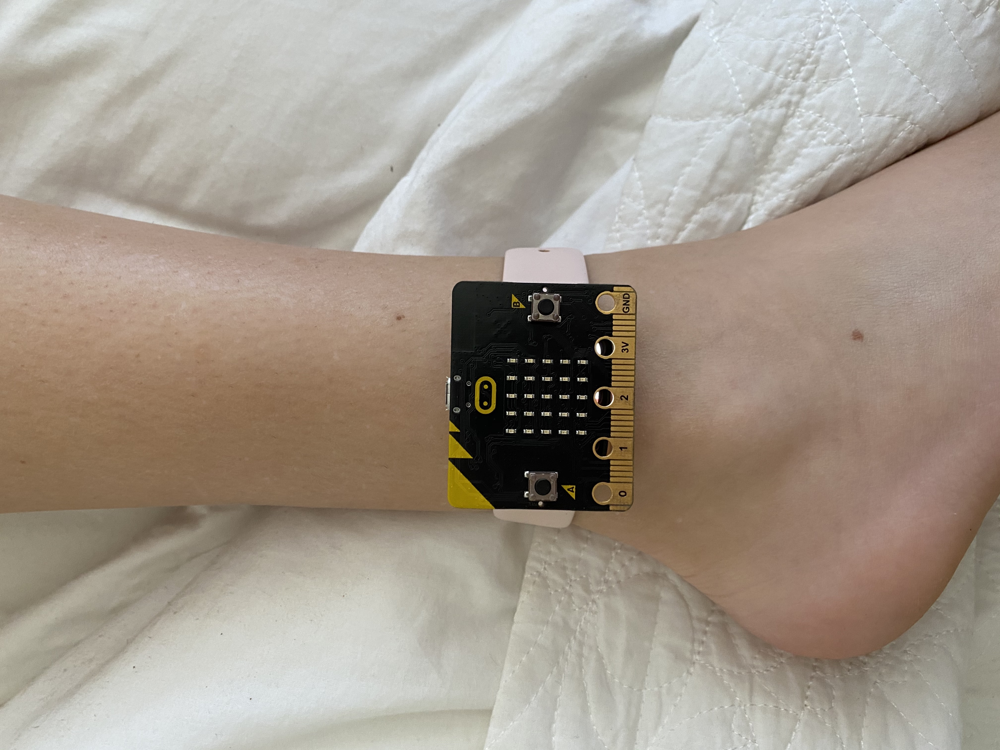

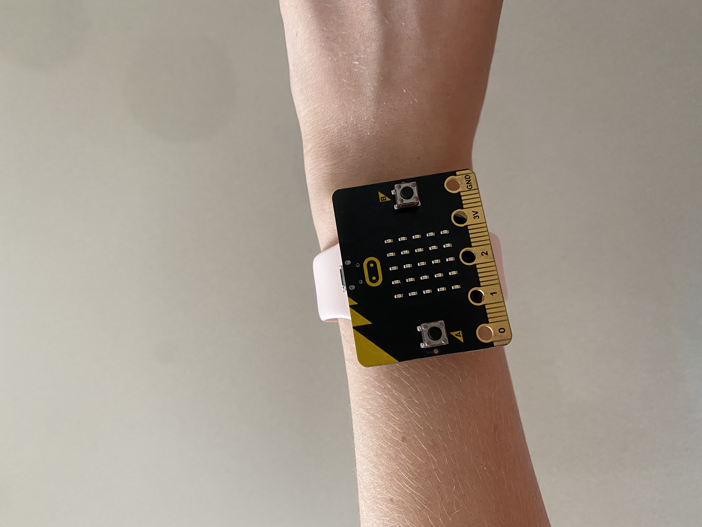

### Interaction flowchart ###

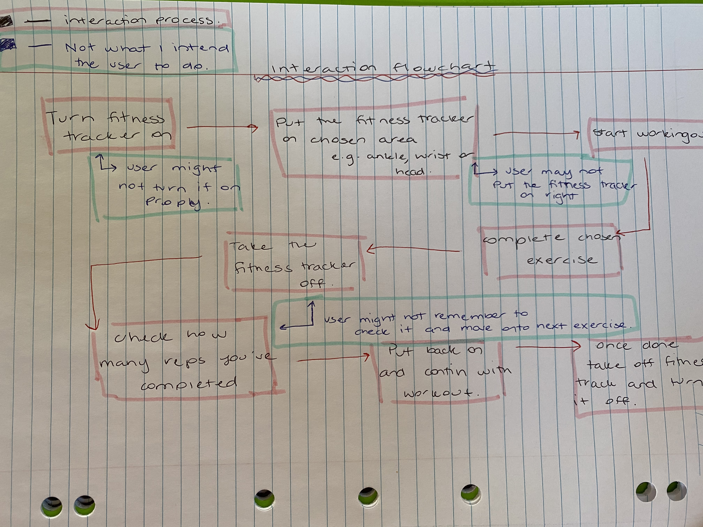

## Physical experimentation documentation ##

*In this section, show your progress including whichever of the following are appropriate for your project at this point.
a.	Technical development. Could be code screenshots, pictures of electronics and hardware testing, video of tests. 
b.	Fabrication. Physical models, rough prototypes, sketches, diagrams of form, material considerations, mood boards, etc.
Ensure you include comments about the choices you've made along the way.*

*You will probably have a range of images and screenshots. Any test videos should be uploaded to YouTube or other publicly accessible site and a link provided here.*

## Design process discussion ##
*Discuss your process in getting to this point, particularly with reference to aspects of the Double Diamond design methodology or other relevant design process.*

## Next steps ##
*Write a list or provide other information about your plan to move the project forward to be ready to present by video and documentation in week 12 of the course.*
